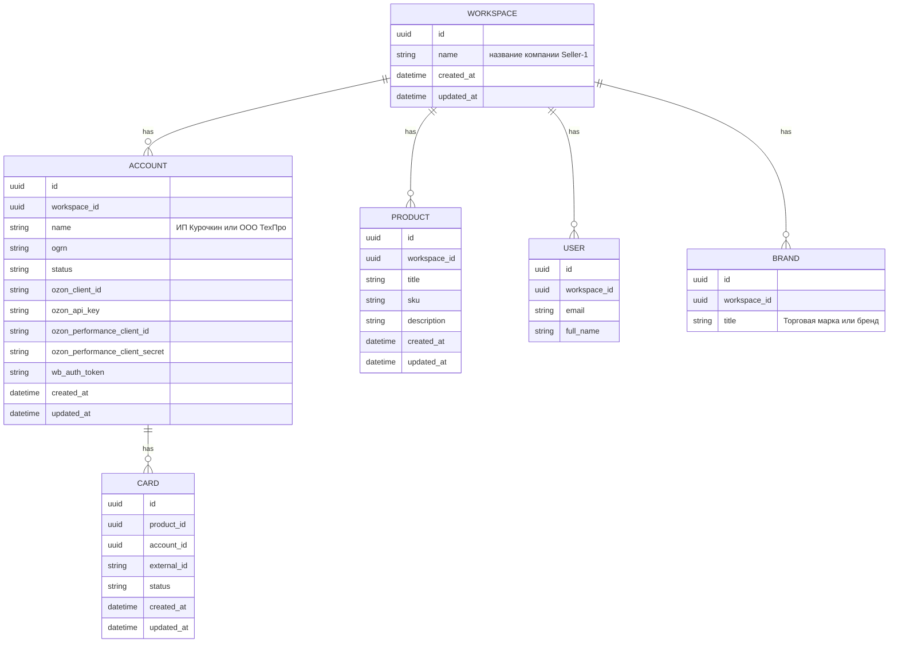

## **Контекст**  
Описание основы системы PIM и ее архитектуры.  

## **Решение**  

Создать сущности: `Workspace`, `Account`, `User`, `Product`, `Card`, `Brand` 

### ✅ `Workspace`  
- У `Workspace` может быть **несколько юридических лиц (`Account`)** (ООО, ИП и т.д.).  
- У каждого юридического лица могут быть **аккаунты/кабинеты** в сторонних сервисах (WB, Ozon, Yandex и т.д.).  
- Все организации объединены в `Workspace`, с которого и осуществляется оплата за SaaS-сервис.  
- Пользователь работает в рамках одного `Workspace`, через который управляет всеми связанными сущностями.
- Представляет собой **группу организаций**, принадлежащих одному владельцу.  
- Используется как **биллинг-единица** — все подписки и платежи происходят от имени `Workspace`.  
- Пользователь управляет всеми своими юридическими лицами и их аккаунтами через `Workspace`.

**Основные поля:**
- `id`
- `name`
- `owner_user_id`
- `billing_plan_id`
- `created_at`, `updated_at`

---

### ✅ `Account`  
- Представляет собой **юридическое лицо** (например, ООО или ИП) и **интеграцию** конкретного юридического лица с внешней платформой (WB, Ozon, Yandex и т.д.).  
- Один `Workspace` может иметь множество `Organization`.  
- Каждое юридическое лицо может иметь несколько аккаунтов в сторонних системах.

**Основные поля:**
- `id`
- `workspace_id` (внешний ключ на `Workspace`)
- `name` (например, "ООО ТехПро")
- `tax_identifier` (ИНН/ОГРН)
- `type` (ООО / ИП и т.д.)
- `created_at`, `updated_at`
- `platform` (например, WB / Ozon / Yandex)
- `store_name` (опционально — название магазина)
- `api_key`
- `active` (bool)

---

## **ERD**

