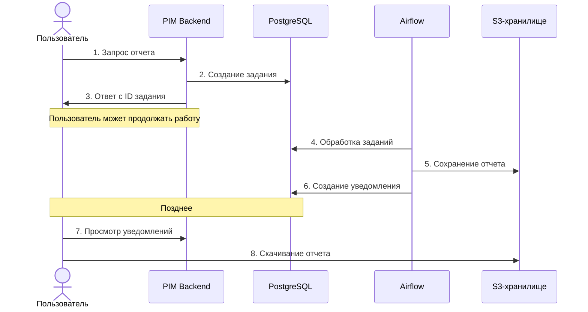
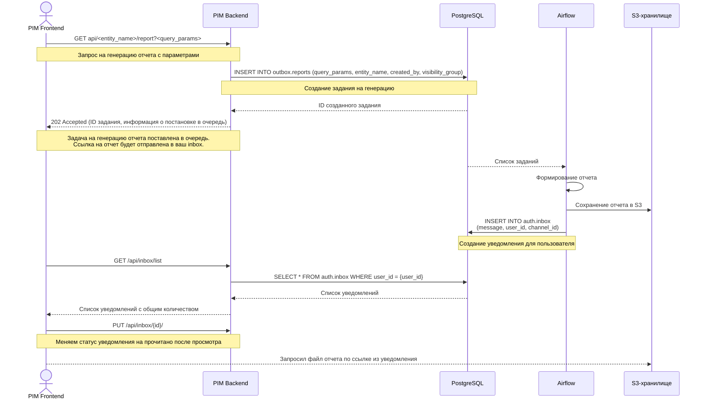

# Техническое решение для асинхронной генерации отчетов

## Описание проблемы

В текущей реализации генерация отчетов для различных сущностей (card, product, др.) выполняется синхронно при обращении к эндпоинту `api/<entity_name>/report`.
По мере роста объема данных и усложнения связей между сущностями, время генерации отчетов значительно увеличилось, что привело к:

- Превышению временных лимитов Яндекс функций и таймаутам на стороне API
- Как итог неудовлетворительный пользовательский опыт

## Предлагаемое решение

Изменение логики работы эндпоинтов `api/<entity_name>/report`:
- Вместо синхронной генерации и возврата отчета, эндпоинты будут создавать задачу на асинхронную генерацию отчета
- Задачи будут сохраняться в таблице `outbox.reports`
- Обработка будет происходить асинхронно на стороне Airflow
- Результаты будут сохраняться в S3-хранилище (как это уже реализовано)
- Пользователь будет получать уведомление о готовности через систему уведомлений (новая сущность `auth.inbox`)

## Схема взаимодействия компонентов

## Процесс асинхронной генерации отчетов

## Изменения в API

### Существующие эндпоинты

| Эндпоинт | Текущее поведение | Новое поведение                                                                                                                                           |
|----------|-------------------|-----------------------------------------------------------------------------------------------------------------------------------------------------------|
| `GET api/<entity_name>/report` | Синхронная генерация и возврат отчета | Создание задания на асинхронную генерацию + возврат ID задания (пока наверно нет нужны использовать ID дальше, просто как факт того что задание создано). |

### Новые эндпоинты

| Эндпоинт           | Метод  | Описание                                                                                                                                                                                                                                                                                                                    |
|--------------------|--------|-----------------------------------------------------------------------------------------------------------------------------------------------------------------------------------------------------------------------------------------------------------------------------------------------------------------------------|
| `/api/inbox/list`  | GET    | Получение списка уведомлений пользователя с пагинацией и фильтрацией по статусу. Если фильтровать по статусу, то общее количество записей можно использовать для отображения в колокольчике непрочитанных сообщений + будет уже какое-то количесто подгруженных сообщений, которые можно быстро отобразить пользователю.    |
| `/api/inbox/{id}/` | PUT    | Обновление статуса уведомления (прочитано/не прочитано)                                                                                                                                                                                                                                                                     |

## Структура таблиц

### Таблица outbox.reports

| Поле             | Тип       | Описание                                         |
|------------------|-----------|--------------------------------------------------|
| id               | uuid      | Уникальный идентификатор отчета                  |
| created_at       | timestamp | Время создания задания                           |
| updated_at       | timestamp | Время последнего обновления                      |
| status           | enum      | Статус: 'new', 'in_progress', 'success', 'error' |
| created_by       | uuid      | ID пользователя, инициировавшего генерацию       |
| entity_name      | string    | Название сущности отчета                         |
| query_params     | jsonb     | Пареметры для генерации отчета                   |
| visibility_group | string    | Группа видимости (для фильтрации)                |
| error_message    | text      | Сообщение об ошибке (если есть)                  |
| s3_key           | string    | Ключ для доступа к файлу в S3                    |

### Таблица auth.inbox

| Поле       | Тип       | Описание                               |
|------------|-----------|----------------------------------------|
| id         | uuid      | Уникальный идентификатор сообщения     |
| created_at | timestamp | Время создания сообщения               |
| subject    | text      | Название сообщения/уведомления         |
| message    | text      | Текст сообщения/уведомления            |
| status     | enum      | Статус: 'new', 'seen'                  |
| channel_id | string    | Идентификатор канала (для группировки) |
| user_id    | uuid      | ID пользователя-получателя             |

**Примечание:** channel_id — это идентификатор, позволяющий логически связывать между собой серию уведомлений, относящихся к одному процессу или действию пользователя.
Это нужно для того, чтобы:
* группировать уведомления в рамках одного треда;
* отслеживать ход выполнения целой цепочки событий (например, все уведомления по одному отчету);
* в будущем — фильтровать и визуально объединять связанные уведомления, даже если между ними попадаются нерелевантные.

## Техническое описание решения

### Изменения на стороне API-сервера

1. Модификация эндпоинтов `api/<entity_name>/report`:
   - Сохранение задания в таблицу `outbox.reports`

### Генерация отчета в Airflow

1. Создание нового DAG в Airflow для обработки заданий из таблицы `outbox.reports`.
   - Периодический опрос таблицы `outbox.reports` на наличие новых заданий
   - Выполнение SQL-запросов из заданий
   - Сохранение результатов в S3-хранилище
   - Создание уведомлений для пользователей

### Система уведомлений

1. Создание новой таблицы `auth.inbox` для хранения сообщений/уведомлений пользователей
2. API для получения и управления уведомлениями:
   - GET `/api/inbox/list` - для получения списка сообщений с пагинацией и возможностью фильтрации по статусу
   - PUT `/api/inbox/{id}` - для отметки сообщений как прочитанных/непрочитанных
